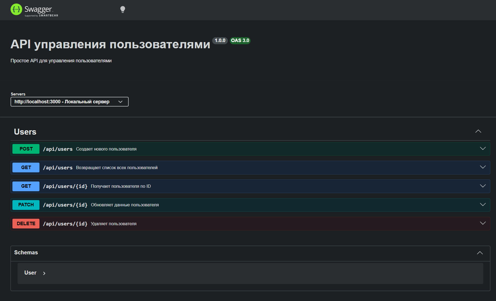
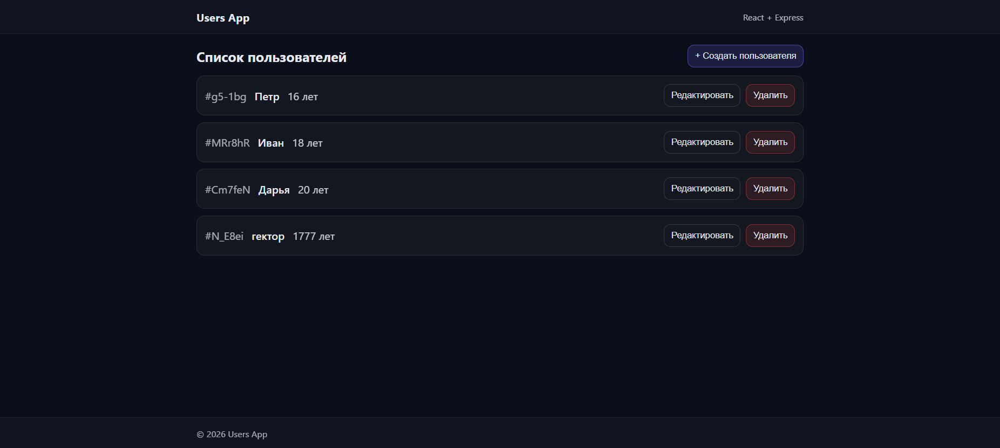
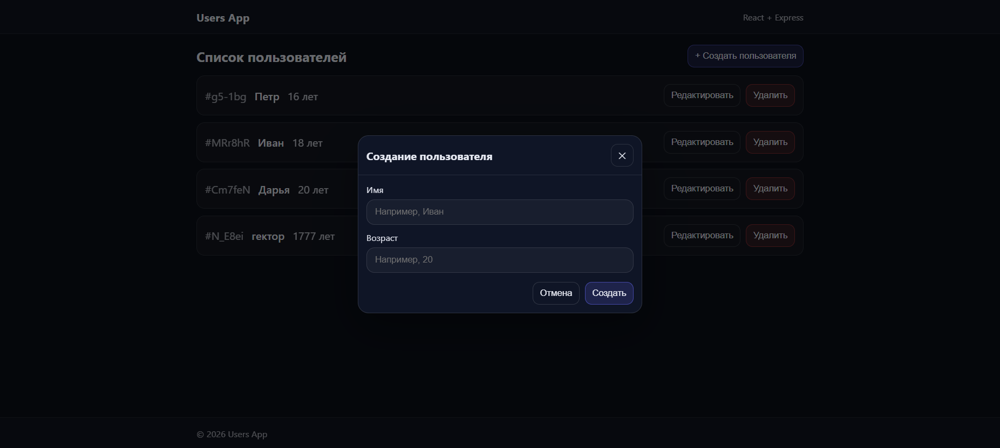

## Практическая работа №6

Данная работа выполнена в рамках дисциплины «Фронтенд и бэкенд разработка».

Приложение для управления пользователями (CRUD) с REST API и Swagger-документацией.

## Стек технологий

| Компонент | Технология |
|-----------|------------|
| Frontend | React |
| Backend | Node.js + Express |
| Документация API | Swagger UI (swagger-jsdoc, swagger-ui-express) |
| ID генерация | nanoid |

---

## Структура проекта

```
products-app/
├── backend/
│   ├── server.js          # Express-сервер с Swagger-документацией
│   └── package.json
└── frontend/
    ├── src/
    │   ├── api/           # API-клиент (axios)
    │   ├── components/    # React-компоненты (UserItem, UserModal, UsersList)
    │   ├── pages/         # Страницы (UsersPage)
    │   └── App.js
    └── package.json
```

---

## Установка и запуск

### Backend

```bash
cd backend
npm install
node server.js
```

Сервер запустится на **http://localhost:3000**

### Frontend

```bash
cd frontend
npm install
npm start
```

Приложение запустится на **http://localhost:3001**

---

## API Endpoints

| Метод | Эндпоинт | Описание |
|-------|----------|----------|
| POST | `/api/users` | Создать пользователя |
| GET | `/api/users` | Получить всех пользователей |
| GET | `/api/users/:id` | Получить пользователя по ID |
| PATCH | `/api/users/:id` | Обновить пользователя |
| DELETE | `/api/users/:id` | Удалить пользователя |

---

## Swagger-документация

После запуска сервера документация доступна по адресу:

**http://localhost:3000/api-docs**

### Скриншот Swagger UI



---

## Ключевые функции

### 1. Просмотр списка пользователей



### 2. Создание нового пользователя



### 3. Редактирование пользователя


---

## Модель данных

**User:**
```json
{
  "id": "string",
  "name": "string",
  "age": "integer"
}
```
